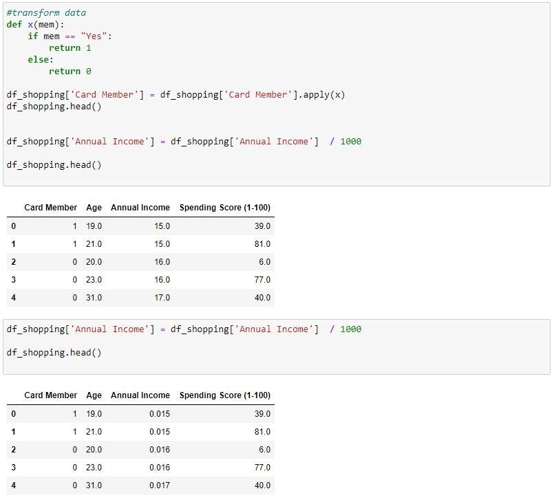
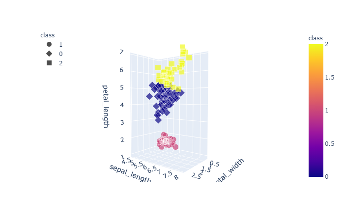
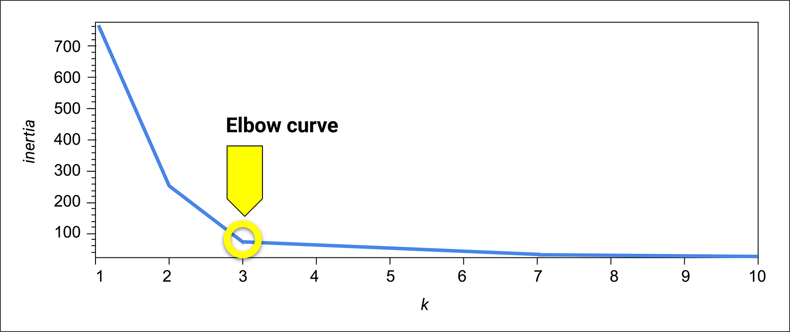
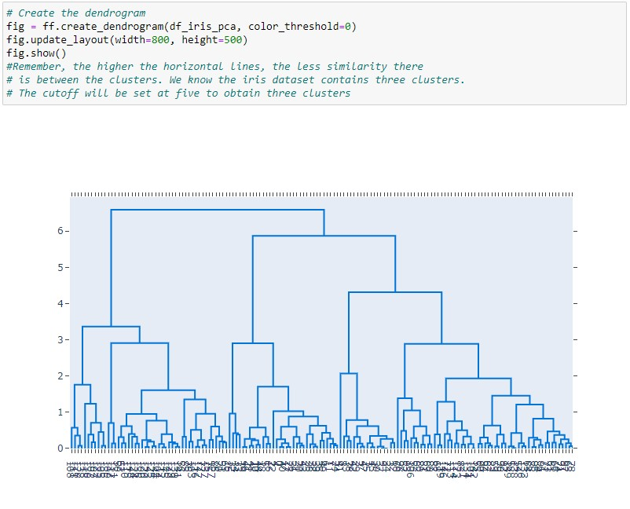
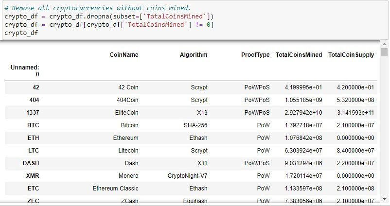
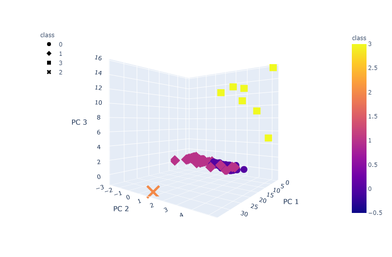
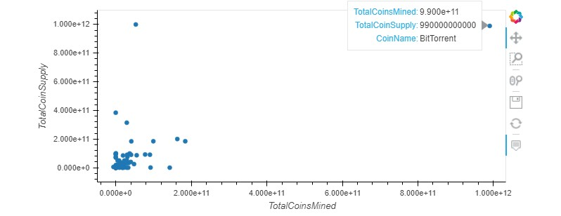

# CryptoCurrency Investment with Unsupervised Machine Learning
Analyzed different cryptocurrencies to extrapolate common patterns and factors for investment firms looking to *invest* in cryptocurrency.

Using unsupervised machine learning models and algorithms on collections of cryptocurrencies to find patterns when a target feature is missing or and all features unlabeled. The primarily algorithm, K-means, will group similar data of cryptocurrency features into clusters. In addition, PCA (Principal Component Analysis) which helps reduce features and avoid overfitting data.  

Here is a rundown of Unsupervised Machine Learning practice: 

- Understand both supervised and unsupervised learning
- Preprocess data for unsupervised learning with Pandas such as removing null constraints and duplicates
- Cluster data using the K-means algorithm with *K* number of clusters with means of data appointed to each cluster
- Determine the best number of centroids clusters for K-means using the elbow-point curve and inertia objective function which measures variation in the dataset
- Use PCA to limit features, avoid overfitting data, and speed up the model by transforming a larger set of variables into a digestible formed set.
- Hierarchical clustering, aka agglomerative clustering, can be used in tandem with K-means that groups (clusters) data points

---

## Unsupervised Machine Learning Practice Datasets
Selected datasets were cleaned and transformed in various methods such as removing null values and duplicates, removing textual-based and ID based columns, and boolean statement data points into strings. These transformations indicate pattern for digestible data for a number-crunching machine, such as a laptop, to perform machine learning.


The dataset requires K clusters; however, trial and error are used to determine the optimal number of clusters, but for the purpose of practice, 3 clusters is optimal number for this dataset. Then, the DataFrame is fit into the K-means model and used to predict the clusters as ```class```. Lastly, visual plots with plotly and hvplot modules are utilized for clustering means. Another method for visualizing the clusters is plotly 3d model. 



After some trial and error, the elbow curve determines the optimal number of K clusters by measuring the amount of variation in the dataset. For this dataset, ```K=3``` was the optimal number of clusters. 



Lastly, to optimize machine learning, PCA (Principal Component Analysis) is utilized to maintain feature dimensionality and avoiding overfitting models. The use of transformation scalars to reduce features results in main ```K-n``` components that contain most of the information in the original dataset, with the components each having a certain ratio of variance of the dataset, although not 100% complete information is contained from the original.

A dendrogram graph is a similar feature to the elbow curve which helps determine the ideal number of clusters by keeping values of points on the x-axis, then connects all the points as they are clustered. An analyst could determine the ideal K clusters, depending on the range of their refined analysis. Starting from ```Y=0```, the higher a horizontal line, the less similarity there is between clusters. This method best fits the hierarchical clustering algorithm.



There are a few points to consider when comparing both K-mean and hierarchical clustering algorithms. K-means is dependent on random initialization, so the outcome depends on a random seed. An analyst might already consider K clusters prior to performing analysis. Utilizing dendrograms with hierarchical clustering, an analyst could pick an optimal number of clusters.


---


## Challenge
Unsupervised machine learning models will be employed to analyze data on the cryptocurrencies traded on the market. K-means clustering algorithm is an optimal choice since an analyst might not decide a target feature, in addition to a manageable number of features (columns).

Some tasks included:
- Prepare dataset for optimization with dimensions reduction with PCA and clustering using K-means
- Predict the number of clusters with elbow curve
- Showcase 2D and 3D scatter plots to analyze clusters and choose the optimal cryptocurrency for investment

Any dataset requires a keen eye from the analyst, where the use of it hinges on details of analysis and usable datapoints. Therefore, a refined cryptocurrency dataset must be molded from cleaning methods such as removing non-trading, non-defined currencies and inhabited null values as well as transforming non-numeric and categorical columns to integer values and boolean columns. A cleaned dataset might look like this: 


Next, Pandas method ```pd.get_dummies``` will create dummy numbers for important textual feature columns and the dataset will be optimized using StandandScalars to scale all values and PCA to reduce variables of large dataset. The elbow curve will determine the optimal number of K clusters, in this case, ```K=4```. A merged dataset of features with PCA components and main ID column is created to showcase a 3-d scatter plot of clusters.


Lastly, a 2-d scatter plot displays a contrast of available coins versus the total number of mined coins, to which an analyst can gather the high volume of a successful coin, such as that of *BitTorrent*. 

